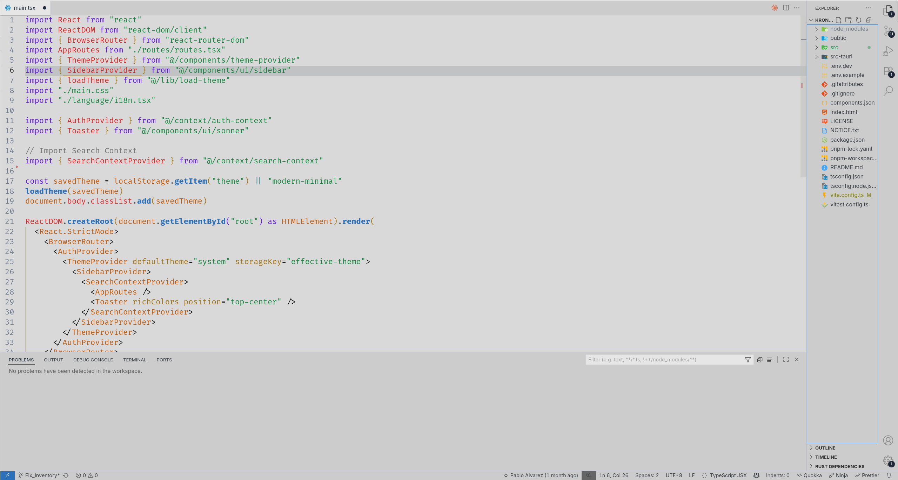
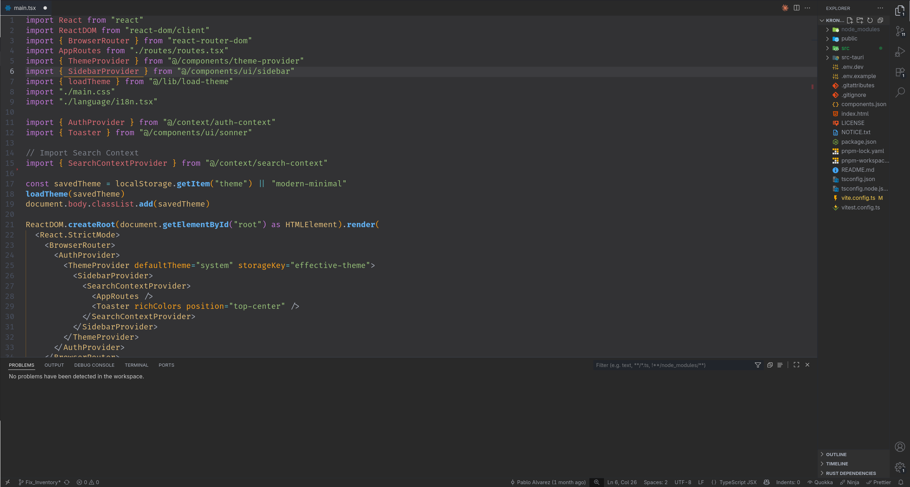

# Equinox Theme for VS Code

**Equinox Theme** is a light and dark color theme for Visual Studio Code that provides a balanced, warm aesthetic for coding. It automatically adapts to your system color scheme and offers a comfortable color palette for long coding sessions.

---

## Features

- Automatic light/dark mode detection.
- Warm, easy-on-the-eyes colors for both light and dark themes.
- Syntax highlighting designed for readability.
- Inspired by the popular OneDark-Pro theme.

---

## Screenshots

### Light Theme



### Dark Theme



---

## Installation

1. Open VS Code.
2. Go to the Extensions view (`Ctrl+Shift+X` or `Cmd+Shift+X` on Mac).
3. Search for `Equinox Theme`.
4. Click **Install** and then **Set Color Theme**.

---

## Configuration

To enable automatic light/dark themes in VS Code, edit your `settings.json` file (accessible via `Ctrl+,` → click on the `{}` icon in the top right) and add the following:

```json
"window.autoDetectColorScheme": true,
"workbench.preferredLightColorTheme": "Equinox-Light",
"workbench.preferredDarkColorTheme": "Equinox-Dark"
```

---

## Acknowledgments

Special thanks to the creators of [OneDark-Pro](https://github.com/Binaryify/OneDark-Pro) for their incredible work and inspiration. This theme served as the foundation and motivation for creating Equinox, particularly in developing the light mode variant. OneDark-Pro's excellent color harmony and readability principles guided the development of both the light and dark versions of this theme.

The Equinox theme aims to capture the essence of what makes OneDark-Pro so beloved while extending that experience to users who prefer light themes or automatic theme switching.
